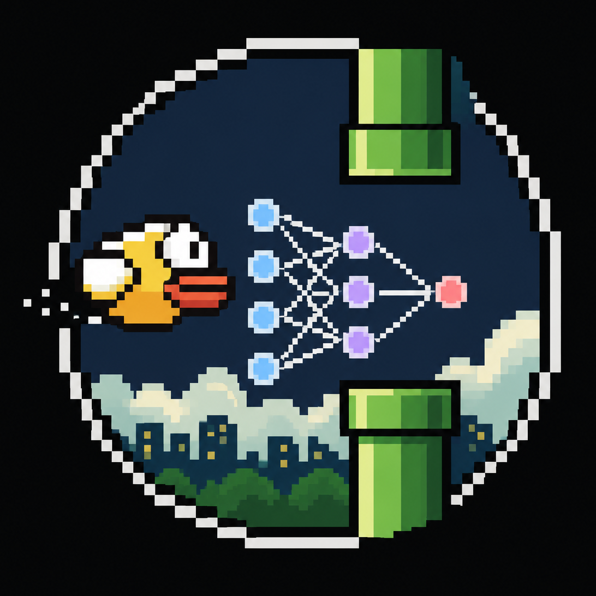
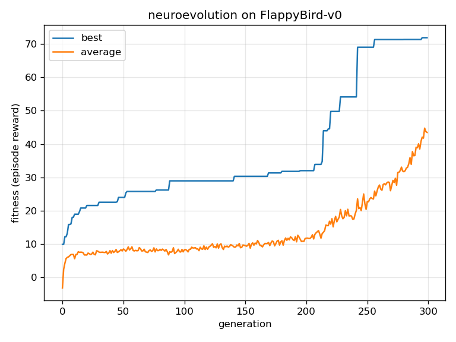

<div align="center">

  

# neuroflap
</div>

### A neural network that learns to play Flappy Bird with **no backpropagation**: only a genetic algorithm (neuroevolution). Built from scratch in Python with [NumPy](https://github.com/numpy/numpy), playing the game from [flappy-bird-gymnasium](https://github.com/markub3327/flappy-bird-gymnasium) on the [Gymnasium](https://github.com/Farama-Foundation/Gymnasium) API

<div align="center">

  ---
  [**Features**](#features) | [**Install**](#install) | [**How it works**](#how-it-works)

  ---

</div>

## Features

🧬 **Pure neuroevolution**: no gradients, no PyTorch: a population of neural nets is improved by selection + mutation only

🐦 **Plays Flappy Bird**: reads the 12-number game state and decides flap / no-flap every frame

🧠 **Tiny NumPy network**: the forward pass is written by hand: all the weights live in one flat vector

📈 **Logs + plots progress**: prints best & average fitness each generation and saves a `fitness.png` curve

👀 **Watch mode**: load the best evolved bird and watch it play in a real game window

🎚️ **Adjust the settings**: population size, mutation, generations and network size

<div align="center">

  

</div>

After ~300 generations the best fitness converges (training reward ≈ 72 on a fixed bank
of levels). On **40 fresh, unseen levels** the evolved bird passes a **median of ~11
pipes** (max 35) and **never dies instantly**, so it generalizes past the levels it
trained on. It reliably *learns to play*, but a expert "never falls" play would need a bigger
network or a stronger optimizer.

## Install

1. **Clone the repository**
```
git clone https://github.com/ris5266/neuroflap.git
cd neuroflap
```

2. **Install the dependencies**
```
pip install -r requirements.txt
```

3. **Train a bird**: evolve a population and save the best one
```
python train.py
```

4. **Watch it play**: opens the game window and plays a few rounds
```
python watch.py
```

## How it works

Every bird is a small neural network. All of its weights are packed into one flat vector called the **genome**, so a "brain" is just a list of numbers the algorithm can copy, mix and tweak.

1. **Start random:** make a population of random genomes (`ga.py`).

2. **Play & score:** each genome plays a few games, its **fitness** is the average reward it collects (`evaluate.py`). Higher = survived longer / passed more pipes.

3. **Select:** good birds become parents via **tournament selection** (pick a few at random, keep the best).

4. **Breed:** copy the very best birds over unchanged (**elitism**), then fill the rest with **mutated** children (small random noise on the weights).

5. **Repeat:** do this for many **generations**. The mutation noise slowly shrinks so the birds fine-tune near the end.

No backpropagation anywhere: the network never computes a gradient. It only ever gets *measured* and the good ones get to reproduce.